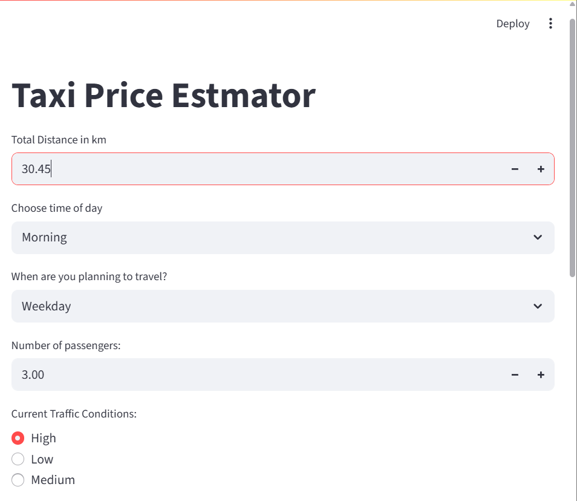

# Taxi Price Estimator 

A Streamlit app to predict taxi fares based on trip distance, time, day, traffic, and weather conditions.

---

## Features

- Predict taxi fare using a trained ML model.
- Inputs:
  - Trip distance (km)
  - Trip duration (minutes)
  - Number of passengers
  - Time of day, day of week
  - Traffic and weather conditions
  - Base fare, per km, per minute rates
- User-friendly **Streamlit interface**

---

## Screenshot




---

## Installation

1. Clone the repository:
```bash
git clone https://github.com/your-username/taxi_price.git
cd taxi_price
